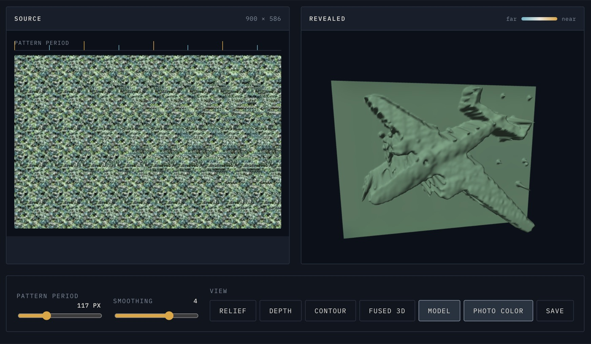

# Magic Eye Decoder

A single-page tool that recovers the hidden 3D surface from an autostereogram (a "Magic Eye" picture) without needing to free-fuse it with your eyes.

Built for the roughly 5–10% of people who have reduced or absent binocular stereopsis and have never once seen the shape everyone else is pointing at.

No build step, no dependencies, no server. Open `index.html` and it runs.

**[Try it live →](https://magic-eye-steel.vercel.app/)**

*An off-the-shelf Magic Eye image (left) and the airplane it hides, recovered and rendered as a real 3D model you can drag to orbit (right).*

## How it works

An autostereogram is a wallpaper pattern that repeats every **P** pixels. Wherever the hidden surface sits closer to the viewer, the corresponding points are drawn slightly **closer together** than P. Your two eyes normally do that measurement. The pixels still carry it, so software can measure it instead.

1. **Estimate the period.** Slide the whole image against itself and score the mismatch at every shift from 20 to 320 px. The strongest dip is the pattern period. Integer multiples of the true period also dip, so the search walks down to the smallest shift that is both nearly as good and a genuinely sharp minimum relative to the image's baseline.

2. **Match every pixel.** For each pixel, search shifts `s` in `[0.70P, 1.05P]` for the one that best matches it to its neighbouring copy. Costs are summed over RGB and aggregated over a 9×7 window, because a single pixel in a field of noise is hopelessly ambiguous on its own.

3. **Read off the depth.** `depth = P − s`. Nearer means a tighter spacing means a bigger value. A parabola fitted through the matching cost at `s−1, s, s+1` refines each match to sub-pixel precision, so gradients come out smooth instead of terraced, and the depth range is stretched to the band the image actually uses (robust 1–99% cut) so the shape has contrast.

4. **Clean and render.** A 3×3 median kills the outliers, optional box passes smooth the surface, then it draws in one of five views: shaded **relief**, a **depth** ramp, **contour** bands, a **fused 3D** view (the poster's own pattern draped in depth with motion parallax — the closest a flat screen gets to what fused eyes see), or an orbitable WebGL **model** of the recovered surface. **Photo color** tints the relief and contour views with the poster's own local pattern colour, taken from a period-scale blur — the raw pixels are pattern noise and carry no object colour.

This is stereo matching where the left and right images happen to be the same picture. The rightmost strip (one search width) has no partner to match against and is trimmed.

Validated against a synthetic stereogram with a known depth map: the period locks exactly, and the recovered surface has a mean absolute depth error of 0.058 on a 0–1 scale.

## Using it

- **Drop, paste, or choose** an image. PNG and JPEG work; HEIC does not, because browsers can't decode it.
- **Pattern period** is auto-detected. If the output looks like noise, this is almost always why. Drag the slider slowly — the picture snaps into a solid shape within a pixel or two of the correct value.
- **Make a test stereogram** synthesises a real one with a known answer (a shark hidden in a blue water texture, like the classic poster), so you can watch the decoder pull it back out and confirm the thing works before trusting it on a real image.
- **Fused 3D** sways the viewpoint on its own and follows your mouse; **Model** is drag-to-orbit. Both respect the system reduce-motion setting.
- **Save** exports whatever view is showing as a PNG.

## Limitations

- Photos of posters must be shot square-on. Perspective skew misaligns the horizontal rows the whole method depends on.
- Wiggle stereograms, anaglyphs, and cross-eye stereo *pairs* are different formats and are not handled. This is for single-image autostereograms only.
- Very low-contrast or heavily JPEG-compressed sources give noisier depth maps.

## Prior art

The generator used for the test image is the classic algorithm from Thimbleby, Inglis and Witten, *Displaying 3D Images: Algorithms for Single Image Random Dot Stereograms* (IEEE Computer, 1994). Recovering shape from a finished autostereogram has been studied properly by Ron Kimmel in *3D Shape Reconstruction from Autostereograms and Stereo* (Journal of Visual Communication and Image Representation, 2002); this implementation is a plain winner-take-all version of the same idea.

## Licence

MIT.
